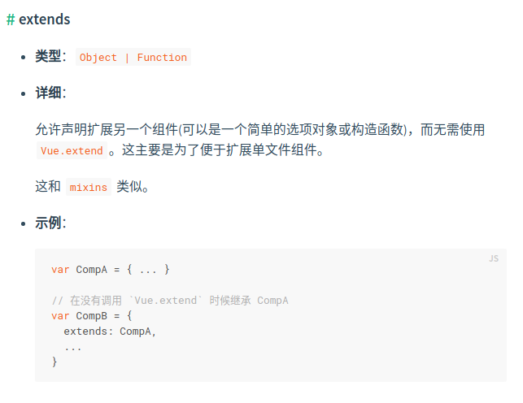

# 你不知道的CSS
## 三角形
> 利用transparent透明属性,如果border每个方向上都不透明,则就是个正方形,想使之变成一个有朝向的三角形,只要该朝向的反向不透明其余透明即可.
```html
<!DOCTYPE html>
<html lang="en">
<head>
    <meta charset="UTF-8">
    <title>triangle</title>
    <style>
        #triangle {
            width: 0;
            height: 0;
            border-top: 300px solid transparent;
            border-left: 300px solid transparent;
            border-right: 300px solid transparent;
            border-bottom: 300px solid #ff0000;
        }
    </style>
</head>
<body>
<div id="triangle"></div>
</body>
</html>

```


将三角形补全
```html
<!DOCTYPE html>
<html lang="en">
<head>
    <meta charset="UTF-8">
    <title>triangle</title>
    <style>
        #triangle {
            width: 0;
            height: 0;
            border-top: 300px solid #ff0000;
            border-left: 300px solid #ff0000;
            border-right: 300px solid #ff0000;
            border-bottom: 300px solid #ff0000;
        }
    </style>
</head>
<body>
<div id="triangle"></div>
</body>
</html>

```


# 你不知道的JS
## new
```js
// function test(name) {
//     this.name = name
//     console.log(this)
// }
//
// test.prototype.sayName = function () {
//     console.log(this.name)
// }
// const t = new test('qfh')
// t.name
// t.sayName()
// //new出来的实例,可以访问构造函数的属性.
// //new出来的实例,可以访问构造函数原型上的方法,通过new,实例与构造函数通过原型链连接了起来.
// function Test(name) {
//     this.name = name
//     // return 'dfasdfasd'
//     return 231231 || 'dfasdfasdf'
// }
//
// const t = new Test('qfh')
// console.log(t.name)

// 如果构造函数返回原始值,那么这个构造函数毫无意义


// function Test(name) {
//     this.name = name
//     return {ddd: 23123}
// }
//
// const t = new Test('qfh')
// console.log(t.name)
// 如果构造函数返回对象,返回值会正常使用


// new:
// - new操作符会返回一个对象
// - 对象可以访问到挂载在this上的任意属性
// - 对象可以访问到构造函数原型上的属性,所以需要将对象与构造函数链接起来
// - 返回原始值无效,返回对象有效

function create(Con, ...args) {
    let obj = {}
    Object.setPrototypeOf(obj, Con.prototype)
    let result = Con.apply(obj, args)
    return result instanceof Object ? result : obj

}

// - Con构造函数,args被构造函数所使用的参数
// - 创建空对象obj
// - 等同于 obj._proto_=Con.prototype
// - 构造函数绑定对象和其余参数
// - 判断构造函数返回的是否是对象?返回对象:否则就是对象本身

function Test(name) {
    this.name = name
    // return '3123123'
    return {
        aa: 12312,
        ddd:234234
    }
}

const t = create(Test, 'qfh')
console.log(t.ddd)

```

## rest
```js
function f(...args) {
    console.log(args)//[ 1, 2, 3, 123, 434, 54, 65563566 ]
    console.log(args[2] + args[3] + args[4])//560
}

f(1, 2, 3, 123, 434, 54, 65563566)
// f(...args)=f(1, 2, 3, 123, 434, 54, 65563566)
// ...args叫做rest参数

```

## generator
```js
function* greeter() {
    yield 'hi'
    yield 'hi2'
    yield 'hi3'
    yield 'hi4'
}

const greet = greeter()
console.log(greet.next().value)
console.log(greet.next().value)
console.log(greet.next().value)
console.log(greet.next().value)
console.log(greet.next().value)
// hi
// hi2
// hi3
// hi4
// undefined
// * yield 那就是generator,生成器函数指下一次next()生成的value,可以是有限的(最后是undefined),也可以是无限的.

```

## promise
```js
const myPromise = new Promise(function (resolve, reject) {
    if (Math.random() < 0.9) {
        return resolve('aaa')
    }
    return reject('bbb')
})

myPromise.then(res => {
    console.log('aaa', res)
}).catch(err => {
    console.log('bbb', err)
})
// promise解决回调地域!将异步逻辑包装在promise中,使用'then'处理成功的,'catch'处理异常的.


```

## prototype
> 但是为什么实例对象里的变量的值却是A呢
```js
function A(name) {
    this.name = name || 'hhh'
}

function B() {
}

B.prototype = A
const c = new B()
console.log(c)
console.log(c.name)
```
这段代码的作用是函数B的原型对象对函数A进行继承,但是B函数本身还是空方法.但是为什么实例对象里的变量却是A呢?
那是因为实例对象c是B函数创建,所以它继承了函数B以及它的原型对象以及它的原型对象的原型对象上的所有属性和方法(就是这条原型链),
所以c里有name变量.然后,回到问题:为什么是A呢?是因为每个函数都有隐藏的name属性,且该属性保存的是该函数名称的字符串.
例如:
```js
function b(){}
console.log(b.name)//b
```

> [JavaScript中函数的name属性](https://blog.csdn.net/goo_oooo/article/details/79242234)

## sort

>  sortFun()是一个函数,是sort排序的依据,<=0则不动,大于0则交换顺序

```js
let arr = [10, 145, 2, 455, 8, -456, 1536, 88, -54,]
const sortFun = (first, second) => first - second
arr.sort(sortFun)
console.log(arr)//[ -456, -54, 2, 8, 10, 88, 145, 455, 1536 ]

```

# 你不知道的Vue

## mixins-extends研究
很多人都用过mixins和extends,但是偏偏就对mixins和extend的执行顺序不慎了解.
那么开启我们的研究吧.


mixins


extends



>官网解释:mixins可以接受一个对象数组,而extend只能扩展一个组件/对象/函数

### mixins和extends执行顺序

```html
<!DOCTYPE html>
<html lang="en">
<head>
    <meta charset="UTF-8">
    <meta name="viewport" content="width=device-width, initial-scale=1.0">
    <meta http-equiv="X-UA-Compatible" content="ie=edge">
    <title>Document</title>
    <script src="https://cdn.bootcss.com/vue/2.5.17-beta.0/vue.min.js"></script>
</head>
<body>
<div id="app">
    <p>mixin的data值为:{{mixinData}}</p>
    <button @click="handleClick()">点我触发handleClick方法</button>
</div>
</body>
<script>
    var mixin = {
        data: {mixinData: '我是mixin的data'},
        created() {
            console.log('这是mixin的created方法')
        },
        methods: {
            handleClick() {
                console.log('这是mixin的handleClick方法')
            }
        }
    }
    var extend = {
        data: {extendData: '我是extend的data'},
        created() {
            console.log('这是extend的created方法')
        },
        methods: {
            handleClick() {
                console.log('这是extend的handleClick方法')
            }
        }
    }

    var vm = new Vue({
        el: '#app',
        data: {mixinData: '我是vue实例里的data'},
        created() {
            console.log('这是vue实例里的created方法')
        },
        methods: {
            handleClick() {
                console.log('这是vue实例里的handleClick方法')
            }
        },
        mixins: [mixin],
        extends: extend
    })
</script>
</html>

```
结果


```text
这是extend的created方法
这是mixin的created方法
这是vue实例里的created方法
这是vue实例里的handleClick方法
```

### 多个mixins和extends执行顺序(mixin在前,mixin2在后)

```html
<!DOCTYPE html>
<html lang="en">
<head>
    <meta charset="UTF-8">
    <meta name="viewport" content="width=device-width, initial-scale=1.0">
    <meta http-equiv="X-UA-Compatible" content="ie=edge">
    <title>Document</title>
    <script src="https://cdn.bootcss.com/vue/2.5.17-beta.0/vue.min.js"></script>
</head>
<body>
<div id="app">
    <p>mixin的data值为:{{mixinData}}</p>
    <button @click="handleClick()">点我触发handleClick方法</button>
</div>
</body>
<script>
    var extend = {
        data: {extendData: '我是extend的data'},
        created() {
            console.log('这是extend的created方法')
        },
        methods: {
            handleClick() {
                console.log('这是extend的handleClick方法')
            }
        }
    }

    var mixin = {
        data: {mixinData: '我是mixin的data'},
        created() {
            console.log('这是mixin的created方法')
        },
        methods: {
            handleClick() {
                console.log('这是mixin的handleClick方法')
            }
        }
    }
    var mixin2 = {
        data: {mixinData: '我是mixin2的data'},
        created() {
            console.log('这是mixin2的created方法')
        },
        methods: {
            handleClick() {
                console.log('这是mixin2的handleClick方法')
            }
        }
    }

    var vm = new Vue({
        el: '#app',
        data: {mixinData: '我是vue实例里的data'},
        created() {
            console.log('这是vue实例里的created方法')
        },
        methods: {
            handleClick() {
                console.log('这是vue实例里的handleClick方法')
            }
        },
        extends: extend,
        mixins: [mixin, mixin2]
    })
</script>
</html>

```
结果


```text
这是extend的created方法
这是mixin的created方法
这是mixin2的created方法
这是vue实例里的created方法
这是vue实例里的handleClick方法
```

### 多个mixins和extends执行顺序(mixin在后,mixin2在前)

```html
<!DOCTYPE html>
<html lang="en">
<head>
    <meta charset="UTF-8">
    <meta name="viewport" content="width=device-width, initial-scale=1.0">
    <meta http-equiv="X-UA-Compatible" content="ie=edge">
    <title>Document</title>
    <script src="https://cdn.bootcss.com/vue/2.5.17-beta.0/vue.min.js"></script>
</head>
<body>
<div id="app">
    <p>mixin的data值为:{{mixinData}}</p>
    <button @click="handleClick()">点我触发handleClick方法</button>
</div>
</body>
<script>
    var extend = {
        data: {extendData: '我是extend的data'},
        created() {
            console.log('这是extend的created方法')
        },
        methods: {
            handleClick() {
                console.log('这是extend的handleClick方法')
            }
        }
    }

    var mixin = {
        data: {mixinData: '我是mixin的data'},
        created() {
            console.log('这是mixin的created方法')
        },
        methods: {
            handleClick() {
                console.log('这是mixin的handleClick方法')
            }
        }
    }
    var mixin2 = {
        data: {mixinData: '我是mixin2的data'},
        created() {
            console.log('这是mixin2的created方法')
        },
        methods: {
            handleClick() {
                console.log('这是mixin2的handleClick方法')
            }
        }
    }

    var vm = new Vue({
        el: '#app',
        data: {mixinData: '我是vue实例里的data'},
        created() {
            console.log('这是vue实例里的created方法')
        },
        methods: {
            handleClick() {
                console.log('这是vue实例里的handleClick方法')
            }
        },
        extends: extend,
        mixins: [mixin2, mixin]
    })
</script>
</html>

```
结果


```text
这是extend的created方法
这是mixin2的created方法
这是mixin的created方法
这是vue实例里的created方法
这是vue实例里的handleClick方法
```

### 多个生命周期
```vue
<!DOCTYPE html>
<html lang="en">
<head>
    <meta charset="UTF-8">
    <meta name="viewport" content="width=device-width, initial-scale=1.0">
    <meta http-equiv="X-UA-Compatible" content="ie=edge">
    <title>Document</title>
    <script src="https://cdn.bootcss.com/vue/2.5.17-beta.0/vue.min.js"></script>
</head>
<body>
<div id="app">
    <p>mixin的data值为:{{mixinData}}</p>
    <button @click="handleClick()">点我触发handleClick方法</button>
</div>
</body>
<script>
    var extend = {
        data: {extendData: '我是extend的data'},
        beforeCreate(){
            console.log('这是extend的beforeCreate方法')
        },
        created() {
            console.log('这是extend的created方法')
        },
        beforeMount(){
            console.log('这是extend的beforeMount方法')
        },
        mounted(){
            console.log('这是extend的mounted方法')
        },
        beforeUpdate(){
            console.log('这是extend的beforeUpdate方法')
        },
        updated(){
            console.log('这是extend的updated方法')
        },
        methods: {
            handleClick() {
                console.log('这是extend的handleClick方法')
            }
        }
    }

    var mixin = {
        data: {mixinData: '我是mixin的data'},
        beforeCreate(){
            console.log('这是mixin的beforeCreate方法')
        },
        created() {
            console.log('这是mixin的created方法')
        },
        beforeMount(){
            console.log('这是mixin的beforeMount方法')
        },
        mounted(){
            console.log('这是mixin的mounted方法')
        },
        beforeUpdate(){
            console.log('这是mixin的beforeUpdate方法')
        },
        updated(){
            console.log('这是mixin的updated方法')
        },
        methods: {
            handleClick() {
                console.log('这是mixin的handleClick方法')
            }
        }
    }
    var mixin2 = {
        data: {mixinData: '我是mixin2的data'},
        beforeCreate(){
            console.log('这是mixin2的beforeCreate方法')
        },
        created() {
            console.log('这是mixin2的created方法')
        },
        beforeMount(){
            console.log('这是mixin2的beforeMount方法')
        },
        mounted(){
            console.log('这是mixin2的mounted方法')
        },
        beforeUpdate(){
            console.log('这是mixin2的beforeUpdate方法')
        },
        updated(){
            console.log('这是mixin2的updated方法')
        },
        methods: {
            handleClick() {
                console.log('这是mixin2的handleClick方法')
            }
        }
    }

    var vm = new Vue({
        el: '#app',
        data: {mixinData: '我是vue实例里的data'},
        beforeCreate(){
            console.log('这是vue实例里的beforeCreate方法')
        },
        created() {
            console.log('这是vue实例里的created方法')
        },
        beforeMount(){
            console.log('这是vue实例里的beforeMount方法')
        },
        mounted(){
            console.log('这是vue实例里的mounted方法')
        },
        beforeUpdate(){
            console.log('这是vue实例里的beforeUpdate方法')
        },
        updated(){
            console.log('这是vue实例里的updated方法')
        },
        methods: {
            handleClick() {
                console.log('这是vue实例里的handleClick方法')
            }
        },
        extends: extend,
        mixins: [mixin2, mixin]
    })
</script>
</html>

```
结果


```text
这是extend的beforeCreate方法
这是mixin2的beforeCreate方法
这是mixin的beforeCreate方法
这是vue实例里的beforeCreate方法
这是extend的created方法
这是mixin2的created方法
这是mixin的created方法
这是vue实例里的created方法
这是extend的beforeMount方法
这是mixin2的beforeMount方法
这是mixin的beforeMount方法
这是vue实例里的beforeMount方法
这是extend的mounted方法
这是mixin2的mounted方法
这是mixin的mounted方法
这是vue实例里的mounted方法
这是vue实例里的handleClick方法
```

### vue实例中没有重名方法和重名变量
```html
<!DOCTYPE html>
<html lang="en">
<head>
    <meta charset="UTF-8">
    <meta name="viewport" content="width=device-width, initial-scale=1.0">
    <meta http-equiv="X-UA-Compatible" content="ie=edge">
    <title>Document</title>
    <script src="https://cdn.bootcss.com/vue/2.5.17-beta.0/vue.min.js"></script>
</head>
<body>
<div id="app">
    <p>mixin的data值为:{{mixinData}}</p>
    <button @click="handleClick()">点我触发handleClick方法</button>
</div>
</body>
<script>
    var extend = {
        data: {extendData: '我是extend的data'},
        beforeCreate(){
            console.log('这是extend的beforeCreate方法')
        },
        created() {
            console.log('这是extend的created方法')
        },
        beforeMount(){
            console.log('这是extend的beforeMount方法')
        },
        mounted(){
            console.log('这是extend的mounted方法')
        },
        beforeUpdate(){
            console.log('这是extend的beforeUpdate方法')
        },
        updated(){
            console.log('这是extend的updated方法')
        },
        methods: {
            handleClick() {
                console.log('这是extend的handleClick方法')
            }
        }
    }

    var mixin = {
        data: {mixinData: '我是mixin的data'},
        beforeCreate(){
            console.log('这是mixin的beforeCreate方法')
        },
        created() {
            console.log('这是mixin的created方法')
        },
        beforeMount(){
            console.log('这是mixin的beforeMount方法')
        },
        mounted(){
            console.log('这是mixin的mounted方法')
        },
        beforeUpdate(){
            console.log('这是mixin的beforeUpdate方法')
        },
        updated(){
            console.log('这是mixin的updated方法')
        },
        methods: {
            handleClick() {
                console.log('这是mixin的handleClick方法')
            }
        }
    }
    var mixin2 = {
        data: {mixinData: '我是mixin2的data'},
        beforeCreate(){
            console.log('这是mixin2的beforeCreate方法')
        },
        created() {
            console.log('这是mixin2的created方法')
        },
        beforeMount(){
            console.log('这是mixin2的beforeMount方法')
        },
        mounted(){
            console.log('这是mixin2的mounted方法')
        },
        beforeUpdate(){
            console.log('这是mixin2的beforeUpdate方法')
        },
        updated(){
            console.log('这是mixin2的updated方法')
        },
        methods: {
            handleClick() {
                console.log('这是mixin2的handleClick方法')
            }
        }
    }

    var vm = new Vue({
        el: '#app',
        beforeCreate(){
            console.log('这是vue实例里的beforeCreate方法')
        },
        created() {
            console.log('这是vue实例里的created方法')
        },
        beforeMount(){
            console.log('这是vue实例里的beforeMount方法')
        },
        mounted(){
            console.log('这是vue实例里的mounted方法')
        },
        beforeUpdate(){
            console.log('这是vue实例里的beforeUpdate方法')
        },
        updated(){
            console.log('这是vue实例里的updated方法')
        },
        extends: extend,
        mixins: [mixin2, mixin]
    })
</script>
</html>

```

结果:


```text
这是extend的beforeCreate方法
这是mixin2的beforeCreate方法
这是mixin的beforeCreate方法
这是vue实例里的beforeCreate方法
这是extend的created方法
这是mixin2的created方法
这是mixin的created方法
这是vue实例里的created方法
这是extend的beforeMount方法
这是mixin2的beforeMount方法
这是mixin的beforeMount方法
这是vue实例里的beforeMount方法
这是extend的mounted方法
这是mixin2的mounted方法
这是mixin的mounted方法
这是vue实例里的mounted方法
这是vue实例里的handleClick方法
这是mixin的handleClick方法
```

## 总结:

1. 先执行extends,再执行mixins,然后才是vue实例的生命周期;
2. 放入多个mixins,按mixins引用的顺序执行;
3. 不能放入两个乃至多个extends;
4. mixins/extends/vue实例生命周期执行顺序都是一样的,都是先一起执行完beforeCreate,然后在到created等生命周期;
5. vue实例里的方法会覆盖mixins和extends的重名方法和重名变量,如果vue实例中没有重名方法和重名变量,那么最后被引用的mixins会覆盖之前的mixins和extends方法和变量.
